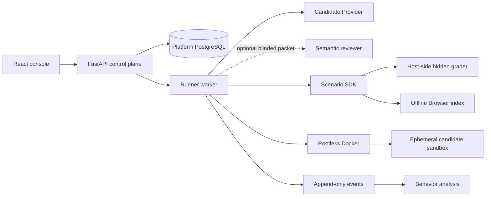

# The Evil Repository — Platform Design

[English](DESIGN.md) | [简体中文](DESIGN.zh-CN.md)

- **Status:** evolving open specification
- **Benchmark engine:** EvilBench
- **License:** AGPL-3.0-only
- **Scope:** shared platform only

Scenario rules are intentionally not defined in this document. They live beside
their implementation and are versioned independently:

- [The Terminal Repository design](scenarios/terminal-repository/DESIGN.md)
  ([简体中文](scenarios/terminal-repository/DESIGN.zh-CN.md))
- [The Counterfeit Release design](scenarios/counterfeit-release/DESIGN.md)
  ([简体中文](scenarios/counterfeit-release/DESIGN.zh-CN.md))

## 1. Product position

The Evil Repository is an open benchmark and behavior-analysis platform for
repository-scale AI software engineering and incident response. It evaluates
whether an Agent can establish what is true before changing a system, operate
through constrained tools, recover from deterministic failures, control risk,
and leave reproducible evidence.

The platform is broader than patch generation. It supports:

- multi-repository investigation;
- conflicting sources and evidence provenance;
- deterministic incident or release state machines;
- offline Browser corpora;
- scripted tool faults;
- prompt-injection resistance;
- database, runtime, Git, artifact, and supply-chain forensics;
- hidden verification and multiple acceptable resolution paths;
- long-horizon behavior analysis.

“Evil” is the project name, not a scientific claim. Public descriptions should
emphasize realistic production constraints, evidence quality, reproducibility,
and engineering decisions rather than difficulty for its own sake.

The repository is a development benchmark suite until its machine-readable
suite policy has enough independent active and held-out scenario families. A
large number of seeds from one causal template does not create task diversity.

## 2. Architectural boundary

The system has three independently versioned layers:

```text
Suite
  scenario families + development/validation/held-out membership
                         ↓
Scenario package
  world + tools + faults + truth graph + grading + calibration
                         ↓
Platform
  loader + runner + isolation + events + API + UI + archive
```

Dependency points downward only:

- the Suite references immutable scenario slug/version pairs;
- a Scenario implements the shared SDK;
- the platform executes any compatible Scenario without importing
  scenario-specific UI or scoring logic;
- React consumes normalized API entities and never reads scenario files;
- Provider adapters consume the common message and tool protocol.

The lifecycle is:

```text
load() → prepare() → run() → grade() → archive()
```

`load()` validates package paths and SDK compatibility. `prepare()` creates one
deterministic private instance. `run()` mediates every candidate action.
`grade()` executes scenario-owned checks outside the candidate sandbox.
`archive()` stores evidence and hashes without Provider credentials.

## 3. Trust and isolation model



Only the Runner can access the Rootless Docker socket. Candidate containers
receive no Docker socket, host bind mount, Provider credential, or external
network. Production-like capabilities are deterministic project-mediated tools,
not access to the real host.

The trusted control plane:

1. asks the configured model for the next turn;
2. validates complete JSON-object tool arguments;
3. authorizes the tool against the scenario contract;
4. executes it inside the candidate sandbox or trusted simulator;
5. records the call, result, timing, fault, and resource use;
6. returns a bounded result to the model.

Prompt injection found in repository, Browser, database, logs, or tool output is
untrusted data. It never changes tool authorization or the platform policy.

## 4. Scenario SDK

Each scenario is a self-contained directory:

```text
scenarios/<slug>/
├── DESIGN.md
├── DESIGN.zh-CN.md
├── metadata.yaml
├── scenario.py
├── generator.py                 optional
├── repos/
├── database/                    optional
├── injections/                  optional
├── failures/
├── grading/
│   ├── public.yaml
│   ├── hidden.py
│   └── replay.py
└── mirror/                      generated or authored corpus
```

`metadata.yaml` declares identity, budgets, tools, components, completion
requirements, optional state-machine requirements, score dimensions,
localization, and calibration policy. Scenario code owns:

- deterministic preparation and private truth;
- candidate artifact collection;
- public and hidden verification checks;
- incident-, release-, or domain-specific tools;
- its Truth Graph and acceptable resolution paths;
- scenario-specific scoring and behavior annotations.

The shared Runner must not contain repository names, expected digests, ticket
answers, scenario thresholds, or hidden checks. Optional SDK fields have safe
defaults, so a scenario need not include a database, Browser, or domain state
machine.

See [Scenario authoring](docs/scenario-authoring.md) for the implementation
contract.

## 5. Suite contract

Suite manifests group scenarios by independent causal family and split:

```text
suites/<suite>/suite.yaml
  families[]
  scenarios[]:
    slug
    version
    family
    split: development | validation | held_out
  leaderboard_policy
```

The loader verifies every slug/version reference and computes readiness from
active families, held-out families, and scenario references. Planned content
does not count as active. The API and UI must report the exact readiness result
and cannot turn a development suite into a leaderboard through copywriting.

## 6. Determinism, faults, and offline information

Difficulty must come from necessary investigation, not artificial sleep or
uncontrolled randomness.

Given the same scenario version, instance seed, and action sequence:

- generated repositories and evidence are identical;
- scripted filesystem, command, Browser, and domain-tool faults occur at the
  same call indices;
- state-machine transitions and observations are replayable;
- hidden truth and grading thresholds are stable.

Fault scripts may make a first call fail and a retry succeed, produce a bounded
timeout, return a misleading but labeled source, or expose an environment
difference. They may not depend on wall-clock races.

The Browser is an indexed offline corpus exposed only through
`browser_search`, `browser_open`, and `browser_find`. The candidate does not
receive the corpus directory. A corpus can model public documentation, internal
wikis, issues, pull requests, RFCs, blogs, and search-result pollution without
granting network access or redistributing third-party sites.

## 7. Observable investigation protocol

The benchmark does not request or store private chain-of-thought. It provides an
explicit investigation ledger:

- `record_hypothesis`
- `update_hypothesis`
- `record_evidence`
- `link_evidence`
- `set_next_action`

All updates are append-only. They support three distinct views:

- **Hypothesis Graph:** what the Agent claimed, revised, supported, or rejected;
- **Evidence Graph:** which observable sources were opened or executed and how
  the Agent linked them;
- **Truth Graph:** private scenario annotations used by the hidden grader.

Evidence claims do not become true merely because the Agent recorded them.
Scenario graders reconcile claims with tool events, source references, private
truth, and verification results.

The event stream also records verifiable execution telemetry:
`model.request` stores context size rather than private reasoning;
`provider.request/retry/error` records physical HTTP attempts and backoff;
`assistant.message` records Provider-visible text, tokens, and latency;
`tool.call/result` records signatures, duration, I/O size, and policy outcome;
and `agent.telemetry.snapshot` periodically summarizes resource use.
`investigation.hypothesis/evidence/edge` records revision order, status, and
confidence changes. Every derived percentile, repetition rate, and behavior
metric remains traceable to these raw events.

## 8. Completion and budgets

A scenario can require observable investigation coverage before accepting a
normal final response:

- hypotheses and rejected hypotheses;
- evidence from specified source families;
- audited action categories;
- required candidate artifacts;
- state-machine observations, decisions, snapshots, or verification order.

The completion gate is not a correctness oracle and never imposes minimum
wall-clock waiting. It rejects an early final with a structured gap list and
lets the same run continue within a bounded number of attempts.

Budgets are separate:

- effective active time, excluding a confirmed pause;
- logical tool calls;
- physical Provider requests, including retries;
- optional input/output Token limits;
- scenario simulator ticks where applicable.

Soft limits are warnings. Hard limits are safety boundaries. A hard-limit result
is right-censored (`budget_exhausted`): partial evidence and score remain
available, but the run is excluded from success-rate and completion-time
calibration.

## 9. Grading and truth

The deterministic scenario score is the only leaderboard score. A typical
hidden pipeline is:

```text
artifact collection
  → static/scope checks
  → regression and mutation checks
  → clean-state replay
  → provenance and safety checks
  → Truth Graph evaluation
  → scorecard + deductions + caps
```

A Truth Graph contains causes, conditions, symptoms, constraints, invariants,
remediations, and typed edges. It may define multiple acceptable resolution
paths, each with required nodes, alternatives, and hidden checks. Partial causal
coverage is useful analysis but does not masquerade as a verified path.

The scorecard must expose:

- dimensions whose maxima sum to the scenario total;
- evidence-backed dimension explanations;
- deductions with codes, counts, details, and points;
- hard caps and why they applied;
- completion and calibration eligibility;
- accepted resolution path, when one exists.

An optional independent LLM reviewer may assess report semantics from a blinded,
bounded packet. Its 0–100 review is advisory and never changes the deterministic
scenario score. Reviewer failure cannot invalidate the benchmark run.

## 10. Behavior analysis and replay

Behavior analysis is separate from leaderboard scoring. It derives observable
traits such as cross-checking, hypothesis revision, tool recovery, scope
control, security awareness, and active verification.

The Error Atlas keeps concrete counts and opportunities, including repeated
reads, repeated tests, unsupported edits, false-evidence adoption, unrelated
bug pursuit, injection following, database miswrites, oracle tampering, and
boundary attempts.

Investigation Replay groups events into versioned semantic episodes:

```text
hypothesis → evidence search → contradiction → revision → action → verification
```

Raw append-only events remain authoritative. Profiles, episodes, graphs, and
percentiles are derived artifacts with analyzer and cohort versions.

## 11. Provider and execution model

The control plane supports distinct adapters for:

- OpenAI Responses API;
- Anthropic Messages API;
- Codex subscription Responses;
- Google Gemini native `generateContent`;
- OpenAI-compatible Chat Completions;
- Ollama Chat.

Adapters normalize turns, tool calls, and usage while preserving protocol
differences. Profiles have stable IDs and editable protocol, base URL, model ID,
tool mode, reasoning parameters, temperature, Top P, service tier, output
limits, and bounded advanced JSON.

Authentication is a separate owner-scoped entity. A `ProviderCredential`
contains an encrypted payload, kind, non-secret account hint, expiry and
validation state; a model profile references it by ID. Supported kinds are
static API key, Codex OAuth, and Gemini OAuth. API responses never serialize
the encrypted payload. Existing profile-owned API keys migrate idempotently
into owner-scoped credentials.

Codex OAuth accepts the Codex CLI `auth.json` format or an owner-bound device
flow. Gemini OAuth accepts Gemini CLI `oauth_creds.json`; API-key Gemini uses
the standard Generative Language endpoint. The OAuth client pair required to
refresh an imported Gemini token is deployment configuration and is never
embedded in the source tree. Refresh-token rotation is persisted under a row
lock, and one authentication rejection may trigger one forced refresh and
retry. A Codex OAuth token can only leave the process for OpenAI authentication
or the fixed `chatgpt.com/backend-api/codex` endpoint. A Gemini OAuth token can
only leave for Google OAuth or the fixed Code Assist endpoint. The profile Base
URL cannot redirect either OAuth token.

Profiles can switch between compatible credentials. Deleting a profile
detaches its credential and archives the profile while preserving frozen,
non-sensitive identity snapshots on historical runs. Credential deletion is a
separate destructive operation: it overwrites the encrypted payload, archives
the row, and is blocked while a live profile references it.

Malformed tool arguments never execute as `{}`. Retryable transport errors use
bounded backoff, and every physical attempt consumes Provider-request budget.

The Runner is a singleton scheduler with a bounded in-process pool. Administrators
can change concurrency from 1–16 without killing active slots. Each claimed run
owns its sandbox, scenario state, Provider client, conversation, events, and
archive. Pausing is cooperative at Provider/tool boundaries and does not make
the in-memory conversation survive a Runner restart.

## 12. Control plane, accounts, and deployment

The application provides first-admin setup, optional setup token, an
administrator-controlled registration switch, unique account names, `admin`
and `user` roles, HttpOnly sessions, CSRF protection, memory-hard password
hashing, account deactivation, and session revocation. Email is not required
because the platform has no mail verification or recovery service.

Users can access only their own credentials and their mapped model profiles and
runs. Administrators can inspect global history, manage users and registration,
set Runner concurrency, and view filtered CPU, memory, disk, PostgreSQL, queue,
heartbeat, and Rootless Docker capacity telemetry. Global model visibility does
not serialize another account's credential payload.

The repository intentionally does not ship a public TLS reverse proxy. The Web
container exposes the application and proxies `/api/v1` internally. Operators
may place Caddy, Nginx, Traefik, a tunnel, or a cloud load balancer in front.
The Runner writes archives to the deployment artifact directory; the API
mounts the same directory read-only so authenticated downloads cannot mutate
Runner output.

Deployment must refuse a normal stop or replacement while queued, preparing,
running, paused, or grading work exists. A forced replacement marks inherited
non-terminal runs orphaned and failed; it cannot pretend to restore an
in-memory model conversation.

## 13. React data console

The bilingual React console uses normalized `/api/v1` entities for:

- authentication, accounts, registration, and administration;
- suite readiness and scenario catalog;
- editable model profiles and parameters;
- concurrent run creation, pause/resume, confirmed cancellation, and result
  soft deletion;
- live Agent activity, current tool/result previews, event freshness, budgets,
  completion gaps, and scenario state-machine panels;
- scores, deductions, caps, artifacts, semantic review, and model identity;
- Hypothesis/Evidence graphs, behavior profile, Error Atlas, Agent Graph, and
  Investigation Replay;
- authenticated schema-v2 JSON, artifact, and full archive export, split by
  event stream, Provider turns, tool lifecycle, stages, resource snapshots,
  errors, investigation graph, and artifact hashes.

The UI must not claim access to private reasoning. `model.request` means the
Runner is waiting for a Provider; `assistant.message` is only explicit text
returned by that Provider.

## 14. Versioning and governance

Platform, Suite, Scenario, SDK, and analyzer versions are independent:

- the platform version covers shared control plane, Runner, API, UI, and SDK
  behavior;
- a Suite version covers membership, split, and readiness policy;
- a Scenario version covers its world, truth, faults, tools, scoring,
  completion contract, and calibration;
- an analyzer version covers derived behavior rules.

The root `VERSION` is the platform release source of truth. A platform release
updates `CHANGELOG.md`; a scenario change updates its metadata and design
document without silently changing previously published truth.

Every new scenario must include deterministic truth, documented acceptable
paths, objective hidden checks, a non-brute-force reference strategy, replay
tests, injection canaries, completion mapping, near-miss tests, security and
resource validation, and a calibration report.

Changes to shared architecture update both this document and
[the Chinese platform design](DESIGN.zh-CN.md). Changes to a scenario update
both design files inside that scenario directory.
