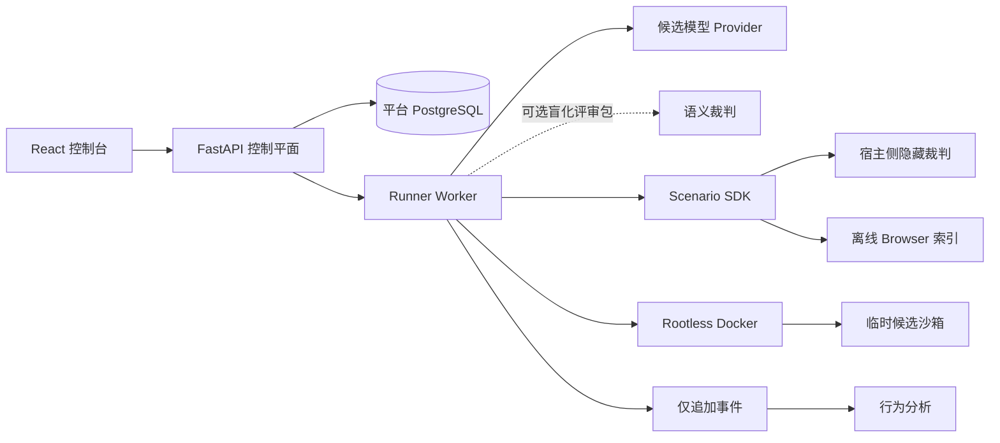

# The Evil Repository — 平台设计

[English](DESIGN.md) | [简体中文](DESIGN.zh-CN.md)

- **状态：** 持续演进的开放规范
- **Benchmark 引擎：** EvilBench
- **许可证：** AGPL-3.0-only
- **范围：** 仅描述共享平台

具体题目的规则不再混入本文。它们与实现放在一起，并拥有独立版本：

- [终焉仓库设计](scenarios/terminal-repository/DESIGN.zh-CN.md)
  ([English](scenarios/terminal-repository/DESIGN.md))
- [赝品发布设计](scenarios/counterfeit-release/DESIGN.zh-CN.md)
  ([English](scenarios/counterfeit-release/DESIGN.md))

## 1. 产品定位

The Evil Repository 是一个开源的仓库级 AI 软件工程、事故响应 Benchmark 与
行为分析平台。它评估 Agent 能否在修改系统之前先证明什么是真的，能否在受限
工具中工作、从确定性故障中恢复、控制工程风险，并留下可复现的证据。

平台不局限于生成补丁，支持：

- 多仓库调查；
- 相互冲突的信息源与证据来源追踪；
- 确定性的事故或发布状态机；
- 离线 Browser 语料；
- 脚本化工具故障；
- Prompt Injection 抵抗；
- 数据库、运行时、Git、产物和供应链取证；
- 隐藏验证与多条可接受解决路径；
- 长时程 Agent 行为分析。

「Evil」是项目名称，不是科学结论。对外说明应强调真实生产约束、证据质量、
可复现性和工程决策，而不是把「很难」本身当成卖点。

只有机器可读的 Suite 策略拥有足够多相互独立的活跃题族和 held-out 题族后，
项目才能宣称具备通用排行榜资格。同一因果模板的大量随机种子不等于任务多样性。

## 2. 架构边界

系统分成三个独立版本层：

```text
Suite
  题族 + development / validation / held-out 成员
                         ↓
Scenario 场景包
  世界 + 工具 + 故障 + 真相图 + 评分 + 校准
                         ↓
Platform 平台
  Loader + Runner + 隔离 + 事件 + API + UI + 归档
```

依赖只能向下：

- Suite 引用不可变的场景 slug/version；
- Scenario 实现共享 SDK；
- 平台执行任何兼容 Scenario，不包含题目专属 UI 或评分逻辑；
- React 只消费标准化 API 实体，不读取场景文件；
- Provider 适配器只依赖统一消息与工具协议。

生命周期固定为：

```text
load() → prepare() → run() → grade() → archive()
```

`load()` 校验包路径与 SDK 兼容性；`prepare()` 创建一个确定性私有实例；
`run()` 中转候选的每项行动；`grade()` 在候选沙箱外运行场景自有检查；
`archive()` 保存证据及哈希，但不保存 Provider 凭据。

## 3. 信任与隔离模型



只有 Runner 能访问 Rootless Docker socket。候选容器没有 Docker socket、
宿主机绑定挂载、Provider 凭据和外部网络。生产风格能力全部由确定性的项目工具
中转，不等于访问真实宿主机。

可信控制平面的调用流程是：

1. 请求所配置模型生成下一轮；
2. 校验工具参数必须是完整 JSON Object；
3. 根据场景契约授权工具；
4. 在候选沙箱或可信模拟器中执行；
5. 记录调用、结果、耗时、故障和资源；
6. 把限长结果返回模型。

仓库、Browser、数据库、日志或工具输出里的 Prompt Injection 都是不可信数据，
不能改变工具授权与平台规则。

## 4. Scenario SDK

每个场景是一个自包含目录：

```text
scenarios/<slug>/
├── DESIGN.md
├── DESIGN.zh-CN.md
├── metadata.yaml
├── scenario.py
├── generator.py                 可选
├── repos/
├── database/                    可选
├── injections/                  可选
├── failures/
├── grading/
│   ├── public.yaml
│   ├── hidden.py
│   └── replay.py
└── mirror/                      生成或人工编写的语料
```

`metadata.yaml` 声明身份、预算、工具、组件、完成条件、可选状态机要求、评分维度、
本地化与校准策略。场景代码拥有：

- 确定性准备过程与私有真相；
- 候选产物收集；
- 公开和隐藏验证检查；
- 事故、发布或其他领域工具；
- Truth Graph 与可接受解决路径；
- 场景专属评分和行为注解。

共享 Runner 不得写死仓库名、预期 Digest、票据答案、场景阈值或隐藏检查。
可选 SDK 字段必须提供安全默认值，因此场景可以没有数据库、Browser 或领域状态机。

实现细则见[场景编写指南](docs/scenario-authoring.md)。

## 5. Suite 契约

Suite Manifest 按独立因果题族和数据划分组织场景：

```text
suites/<suite>/suite.yaml
  families[]
  scenarios[]:
    slug
    version
    family
    split: development | validation | held_out
  leaderboard_policy
```

Loader 会验证每个 slug/version 引用，并根据活跃题族、held-out 题族和场景引用
数量计算就绪状态。planned 内容不算 active。API 与 UI 必须展示真实就绪结果，
不能通过文案把开发套件包装成排行榜。

## 6. 确定性、故障与离线信息

难度必须来自不可省略的调查，而不是人工 `sleep` 或不可控随机。

给定相同场景版本、实例种子和行动序列：

- 生成的仓库与证据完全相同；
- 文件、命令、Browser 和领域工具故障发生在相同调用位置；
- 状态机转移与观察可以重放；
- 私有真相和评分阈值保持稳定。

故障脚本可以让第一次调用失败、重试成功，可以产生有界超时、返回带来源的误导
信息，或暴露新旧环境差异，但不得依赖真实墙上时间竞争。

Browser 是只通过 `browser_search`、`browser_open`、`browser_find` 暴露的离线
索引。候选拿不到语料目录。语料可以模拟公开文档、内部 Wiki、Issue、PR、RFC、
博客和搜索污染，而不开放真实网络或复制第三方站点。

## 7. 可观察调查协议

Benchmark 不索取或保存模型的私有思维链，而提供显式调查账本：

- `record_hypothesis`
- `update_hypothesis`
- `record_evidence`
- `link_evidence`
- `set_next_action`

所有更新仅追加，由此构造三个明确分离的视图：

- **Hypothesis Graph：** Agent 提出、修订、支持或否决过什么；
- **Evidence Graph：** 实际打开或执行了哪些来源，以及 Agent 如何连接它们；
- **Truth Graph：** 隐藏裁判使用的场景私有注解。

Agent 记录一条证据，不代表该证据就是真的。场景裁判必须把主张与工具事件、
来源引用、私有真相和验证结果交叉核对。

事件流同时记录可验证的执行遥测：`model.request` 保存上下文规模而非隐藏思维，
`provider.request/retry/error` 保存真实 HTTP 尝试和退避，`assistant.message`
保存 Provider 明示文本、Token 与延迟，`tool.call/result` 保存调用签名、耗时、
I/O 大小和策略结果，`agent.telemetry.snapshot` 周期汇总资源消耗。
`investigation.hypothesis/evidence/edge` 记录修订序号、状态与置信度变化。所有
派生 P50/P95、重复率和行为指标都能回溯到这些原始事件。

Runner 负责的是确定性的传输安全边界，而不是替模型思考的语义记忆预言机。原始
消息历史超过配置字符阈值后，它会保留 System Contract、初始任务、由候选模型
显式 Hypothesis/Evidence 状态构成的限长检查点，以及最新一组完整的
Assistant Call / Tool Result 协议块；被移出的原始块仍留在不可变事件流中。
`context.compacted` 会精确记录移除了什么、截断了多少。明确区分的
`ProviderContextLengthError` 可让同一逻辑轮次进行两级逐步收缩重试；恢复成功的
拒绝仍可审计，但不会把已经完成的轮次错误标成失败。这样既避免 Provider 传输
上限意外成为 Benchmark 硬终点，又继续奖励主动维护持久调查状态的 Agent。

Provider 内容策略拒绝使用另一条单次恢复路径。Runner 不会重放或混淆被拒绝的
原始材料，而是移除最近的未受信任对话块，只保留限长显式账本，并添加可见的安全
维护续轮标记；第二次拒绝仍然是终止条件。这样可避免一次误报抹掉整场长任务，同时
不会把平台变成绕过 Provider 策略的工具。

## 8. Completion 与预算

场景可以在接受普通 Final 之前要求可观察的调查覆盖：

- 假设与已否决假设；
- 指定来源族的证据；
- 经审计的行动类型；
- 必须生成的候选产物；
- 状态机观察、决策、快照或验证顺序。

Completion Gate 不是正确性预言机，也不能要求最短墙上等待。Agent 过早交卷时，
Runner 返回结构化缺口，并允许同一次运行在有限次数内继续。

预算彼此独立：

- 扣除已确认暂停时间后的有效运行时间；
- 逻辑工具调用；
- 包含重试的真实 Provider HTTP 请求；
- 可选输入/输出 Token；
- 场景模拟器 Tick（如果启用）。

软限制只告警，硬限制是安全边界。触及硬限制的运行属于右删失
`budget_exhausted`：保留部分证据和分数，但不进入成功率与完成时间校准。

## 9. 评分与真相

只有确定性的场景分数进入排行榜。典型隐藏流水线是：

```text
产物收集
  → 静态与范围检查
  → 回归和变异测试
  → 全新状态重放
  → 来源与安全检查
  → Truth Graph 判定
  → Scorecard + 扣分 + 上限
```

Truth Graph 包含原因、条件、症状、约束、不变量、修复和带类型的边。它可以声明
多条可接受解决路径，每条路径拥有必需节点、备选节点组和隐藏检查。部分因果覆盖
有分析价值，但不能伪装成完整通过。

Scorecard 必须公开：

- 总和等于场景满分的评分维度；
- 每个维度有证据支撑的解释；
- 带代码、次数、详情和分值的扣分项；
- 分数上限及触发原因；
- Completion 与校准资格；
- 已接受的解决路径（如果存在）。

可选独立 LLM 裁判可以读取盲化、限长的评审包，给出 0–100 语义评价。该结果只作
辅助分析，永远不能修改确定性主分；裁判故障也不能使候选运行作废。

## 10. 行为分析与回放

行为画像与排行榜评分分离。平台从可观察事件派生证据交叉验证、假设修正、
工具恢复、范围控制、安全意识和主动验证等特征。

Error Atlas 保留具体计数和机会数，包括重复读取、重复测试、无证据编辑、误信
虚假证据、追踪无关 Bug、执行注入、误改数据库、篡改预言机和越界尝试。

Investigation Replay 把事件组合成带版本的语义 Episode：

```text
假设 → 查证 → 冲突 → 修订 → 行动 → 验证
```

原始仅追加事件始终是权威数据。画像、Episode、图谱和百分位属于带分析器版本与
Cohort 版本的派生产物。

## 11. Provider 与执行模型

控制平面明确支持六种不同适配器：

- OpenAI Responses API；
- Anthropic Messages API 或官方 Claude Agent SDK；
- Codex 订阅版 Responses；
- Google Gemini 原生 `generateContent`；
- OpenAI-compatible Chat Completions；
- Ollama Chat。

适配器统一 Turn、工具调用与 Usage，同时保留协议差异。Profile 使用稳定 ID，
可编辑协议、Base URL、模型 ID、工具模式、推理参数、温度、Top P、服务挡位、
最大输出和有界高级 JSON。

认证是独立的按 Owner 隔离实体。`ProviderCredential` 保存加密 Payload、类型、
非敏感账户提示、到期与验证状态；模型 Profile 只引用其 ID。支持静态 API Key、
Claude Code OAuth、Codex OAuth 与 Gemini OAuth 四种类型。API 响应永远不序列化
密文。旧版由 Profile 独占的 API Key 会在启动时幂等迁移成 Owner 级凭据。

Claude Code OAuth 只接受官方 `claude setup-token` 命令输出的长期令牌；平台不实现
Claude.ai 授权端点。令牌只通过子进程环境变量交给镜像内置的官方 Python Agent
SDK。每个真实 Provider Turn 都使用全新的空配置目录，并强制 `tools=[]`、空设置
来源、无 MCP、无 Skill/Plugin、`dontAsk` 权限和无会话持久化，同时关闭非必要
网络流量。SDK 只返回符合 Schema 的归一化下一步动作；已有 Runner 仍是全部工具、
候选工作区、故障脚本、暂停/取消边界、预算与遥测的唯一执行者。因此 Claude Code
拿不到 Docker Socket、仓库挂载、Browser 网络或未被记录的备用工具路径。

Codex OAuth 支持导入 Codex CLI `auth.json` 或绑定当前用户的设备登录；Gemini
OAuth 支持导入 Gemini CLI `oauth_creds.json`，API Key 模式则使用标准 Generative
Language 端点。刷新导入的 Gemini Token 所需 OAuth 客户端凭据只允许由部署环境
配置，不会内置在源码中。Refresh Token 轮换在行锁下落库；认证被拒后最多强制
刷新并重试一次。Codex 刷新请求使用官方 JSON 协议，并原子保存轮换后的 Refresh
Token；导入的 `auth.json` 只是快照，不能当作多个客户端可安全共享的 Token
存储。Codex OAuth Token 只能发往 OpenAI 认证域名或固定的
`chatgpt.com/backend-api/codex`；Gemini OAuth Token 只能发往 Google OAuth 或
固定 Code Assist 端点。Profile BaseURL 不能把两类 OAuth Token 重定向走。

Codex OAuth Provisioning 还包含账户模型发现：控制平面使用账户 Access Token 与
ChatGPT Account ID 请求固定的官方 `/backend-api/codex/models`，只接受
`visibility=list` 的目录项，并为 Owner 幂等创建启用的 Codex Profile 与访问映射。
目录同步不会删除、停用或覆盖用户已有 Profile；相同模型与凭据组合只创建一次。
稳定 Codex Client 版本通过无凭据 GitHub Release 请求按小时缓存，失败时使用随
平台版本验证的回退值。OAuth 导入和设备登录由 WebUI 自动触发同步，认证中心保留
显式重试入口。

Claude Code OAuth 会幂等创建官方 `opus`、`sonnet`、`haiku` 运行时别名，因为
Anthropic Agent SDK 不提供公开的账户级模型目录；别名解析与套餐权限仍由
Anthropic 在运行时决定。令牌被拒后，凭据会标成 `needs_reauth`，原地替换密文
不会破坏现有模型引用。该通道只允许个人自托管或组织内部部署；公开第三方服务
必须使用 Anthropic Console API Key 或受支持云 Provider，不能代用户转发订阅
凭据。

Profile 可以切换兼容凭据。删除模型配置会解除凭据引用并归档 Profile，在历史
运行里保留冻结的非敏感模型身份。凭据删除是独立破坏性操作：覆盖加密 Payload、
归档记录，而且只要仍有 Profile 引用就必须拒绝。

损坏工具参数绝不能按 `{}` 执行。可重试传输错误使用有界退避，每次真实 HTTP
尝试都消耗 Provider 请求预算。

Runner 是带有界进程内线程池的单例调度器。管理员可以在 1–16 之间动态修改并发，
不会杀死活跃槽位。每个已领取运行独占沙箱、场景状态、Provider Client、对话、
事件和归档。暂停只在 Provider/工具边界协作生效，不代表内存对话能跨 Runner
重启恢复。

每次新运行都会冻结最小 `task_snapshot`（ID、Slug、版本、名称、说明与本地化），
因此场景改名或升级后历史归档仍显示运行当时的身份。旧运行回退到当前
`task_id`。WebUI 对场景使用稳定优先级排序，场景卡片的直达链接通过受控
`task` 查询参数选中正确版本；运行归档可按文本、场景、候选模型和状态筛选。

## 12. 控制平面、账户与部署

应用提供首次管理员初始化、可选 Setup Token、管理员注册开关、全局唯一账户名、
`admin` / `user` 角色、HttpOnly Session、CSRF、防内存破解密码哈希、账户停用和
会话撤销。因为平台没有邮件验证和密码找回服务，所以不强制要求邮箱。

普通用户只能访问自己的凭据，以及映射给自己的模型配置与运行。管理员可以检查
全局历史、管理用户和注册、调整 Runner 并发，并查看经过筛选的 CPU、内存、磁盘、
PostgreSQL、队列、心跳与 Rootless Docker 容量指标。管理员能看见全局模型不代表
API 会序列化其他账户的凭据 Payload。

仓库不内置公网 TLS 反向代理。Web 容器暴露应用，并在内部代理 `/api/v1`。
部署者可自行使用 Caddy、Nginx、Traefik、Tunnel 或云负载均衡。
Runner 对部署制品目录拥有写权限；API 只读挂载同一目录，让已认证下载能够读取
归档，却不能通过下载面修改 Runner 产物。

正常停止或替换服务前必须拒绝仍有 queued、preparing、running、paused 或 grading
任务的操作。强制替换应把继承的非终态运行标记为 orphaned/failed，不能伪装成
恢复已经消失的模型对话。

## 13. React 数据控制台

中英双语 React 控制台通过标准化 `/api/v1` 实体提供：

- 登录、账户、注册和管理员后台；
- Suite 就绪状态与场景目录；
- 可编辑模型配置和详细参数；
- 并发创建运行、暂停/继续、确认取消和结果软删除；
- 实时 Agent 活动、当前工具/结果预览、事件新鲜度、预算、Completion 缺口和
  场景状态机面板；
- 得分、扣分、上限、产物、语义裁判和模型身份；
- Hypothesis/Evidence Graph、行为画像、Error Atlas、Agent Graph 与 Replay；
- 需要认证的 Schema v2 JSON、产物和完整归档导出；归档按事件、Provider 轮次、
  工具生命周期、阶段、资源快照、错误、调查图谱和产物哈希分层。

UI 不能声称读取私有思维链。`model.request` 只表示 Runner 正在等待 Provider；
`assistant.message` 只包含 Provider 明确返回的文本。

## 14. 版本与开源治理

平台、Suite、Scenario、SDK 与分析器版本相互独立：

- 平台版本覆盖共享控制平面、Runner、API、UI 与 SDK 行为；
- Suite 版本覆盖成员、Split 与就绪策略；
- Scenario 版本覆盖题目世界、真相、故障、工具、评分、Completion 和校准；
- 分析器版本覆盖派生行为规则。

根目录 `VERSION` 是平台发布版本的事实来源。平台发布更新 `CHANGELOG.md`；
场景修改更新自己的 Metadata 与设计文档，不能静默改变已经发布的真相。

每个新场景必须包含确定性真相、文档化可接受路径、客观隐藏检查、非穷举参考策略、
重放测试、注入 Canary、Completion 映射、近似错误方案测试、安全与资源验证，
以及校准报告。

共享架构变更必须同时更新本文与[英文平台设计](DESIGN.md)。场景变更必须同时更新
该场景目录内的中英文设计文件。
